<div align="center">

  

# 2S Homewear — Sales Mobile App

  <p align="center">
    A Flutter mobile application integrated with <strong>Odoo ERP</strong>, built using <strong>Clean Architecture</strong>, <strong>BLoC (Cubit)</strong>, and <strong>Offline-First Hive Sync</strong>.
  </p>

  <p align="center">
    <a href="https://flutter.dev"></a>
    <a href="https://dart.dev"></a>
    <a href="https://bloclibrary.dev"></a>
    <a href="https://pub.dev/packages/get_it"></a>
    <a href="https://pub.dev/packages/hive"></a>
    <a href="https://www.odoo.com"></a>
  </p>

</div>

---

## 📌 Overview

**2S Homewear** is an enterprise sales application connected directly to Odoo ERP. It empowers sales representatives with real-time customer data management, Egyptian mobile phone validation, and sales order lifecycle management — with **complete offline caching and automatic two-way background synchronization**.

---

## 📱 Visual Showcase (Screenshots)

### 1. Onboarding & Authentication

| Splash Screen | Login Screen |
| :---: | :---: |
| 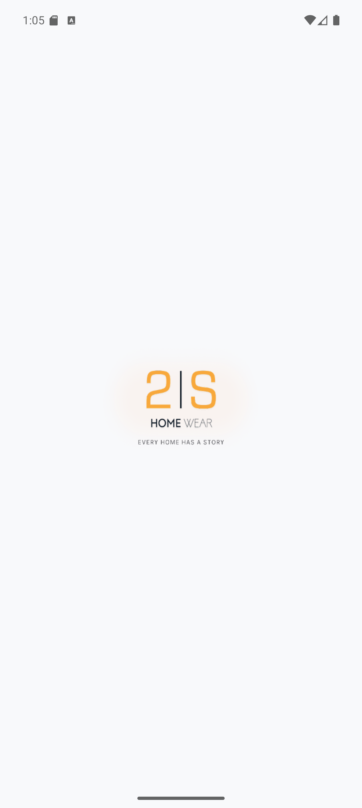 | 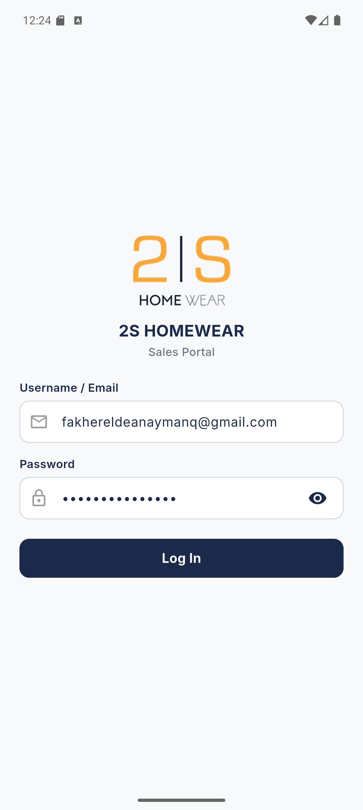 |
| Native Splash with App Logo | Odoo Credentials Entry |

| Login Error Dialog | Session Expired (Auto-Logout) |
| :---: | :---: |
| 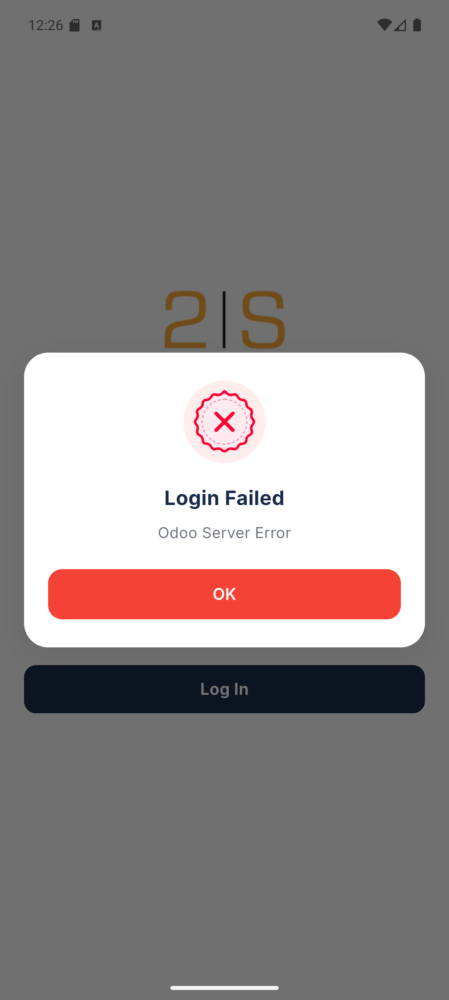 | 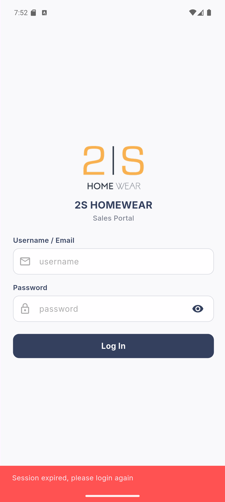 |
| Clear Error Alert | Interceptor Expiry & SnackBar |

### 2. Customers Management & Validation

| Customer List | Instant Search | Customer Details |
| :---: | :---: | :---: |
| 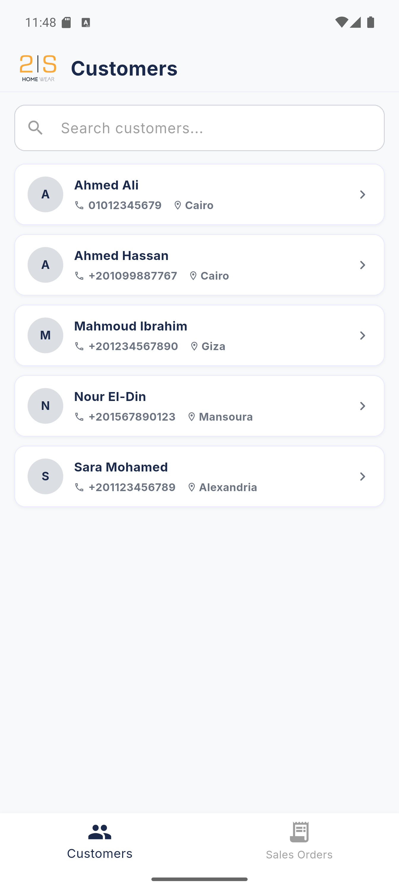 | 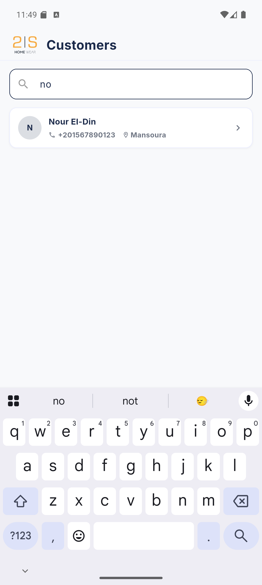 | 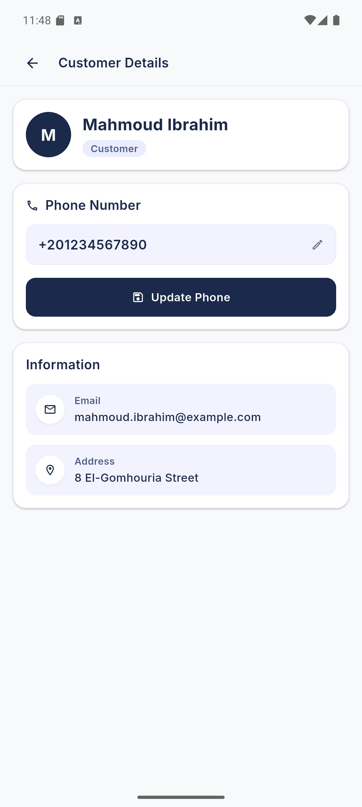 |
| Fetches `customer_rank > 0` | Real-time Search by Name | Address, Email & Phone |

| Edit Phone | Phone Validation Error | Update Success |
| :---: | :---: | :---: |
| 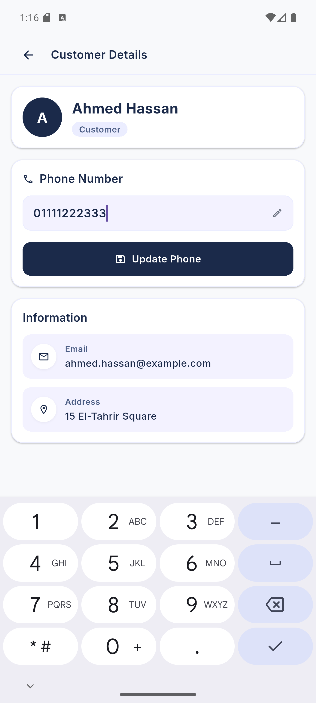 | 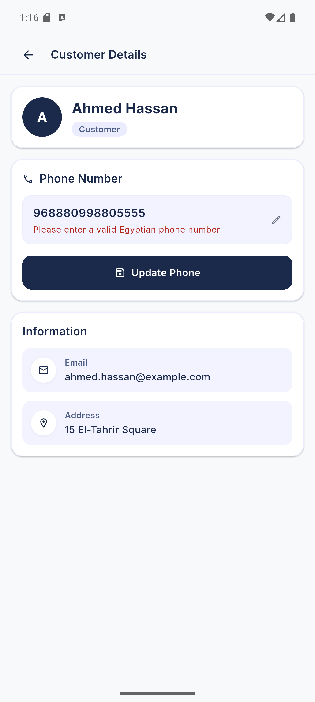 | 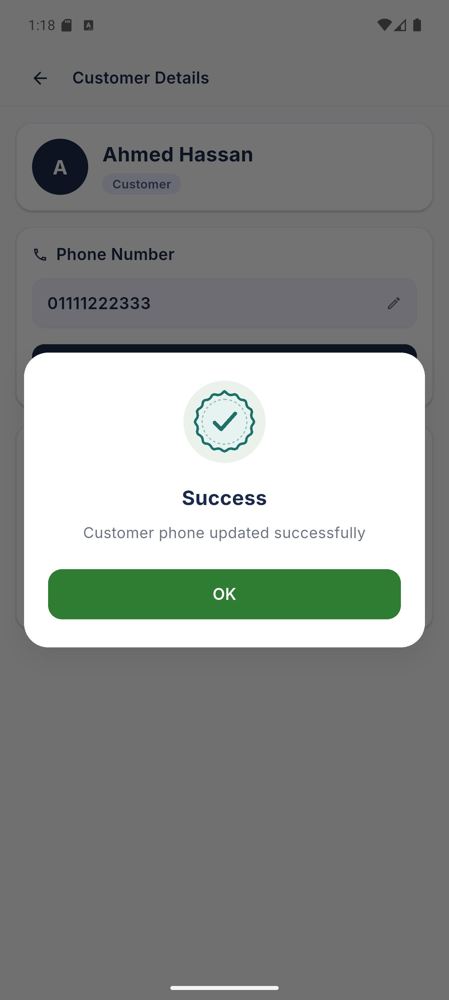 |
| In-place Editing | Egyptian Mobile Regex Check | Synced directly to Odoo |

### 3. Sales Orders Workflow & RBAC

#### Access Control & Order Filtering

| Access Restricted | Sales Orders (All) |
| :---: | :---: |
| 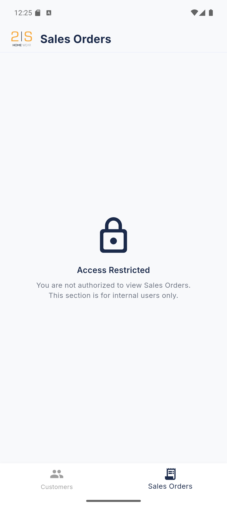 | 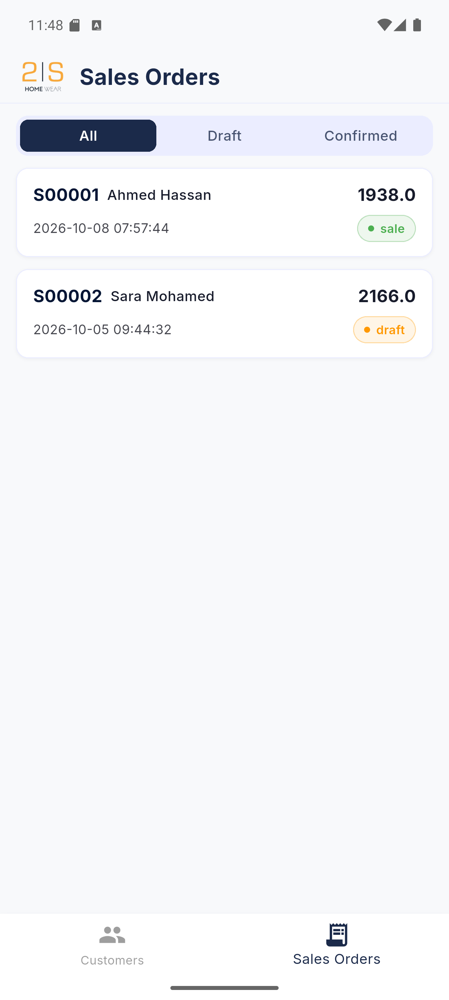 |
| Non-internal users restricted | All commercial orders (`sale.order`) |

| Sales Orders (Draft) | Sales Orders (Confirmed) |
| :---: | :---: |
| 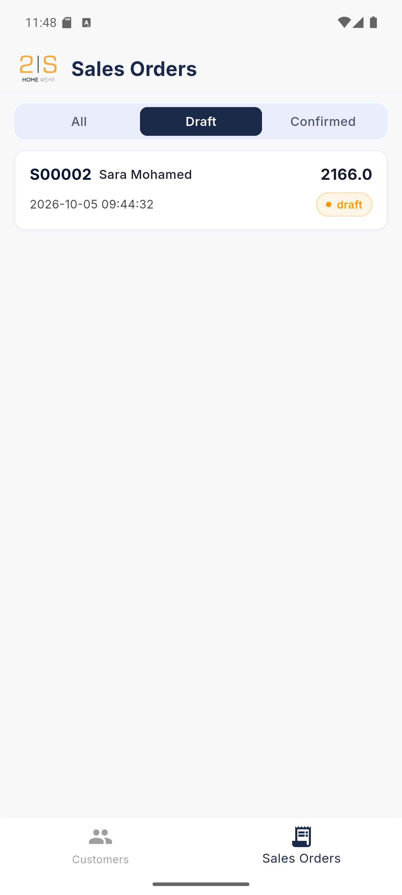 | 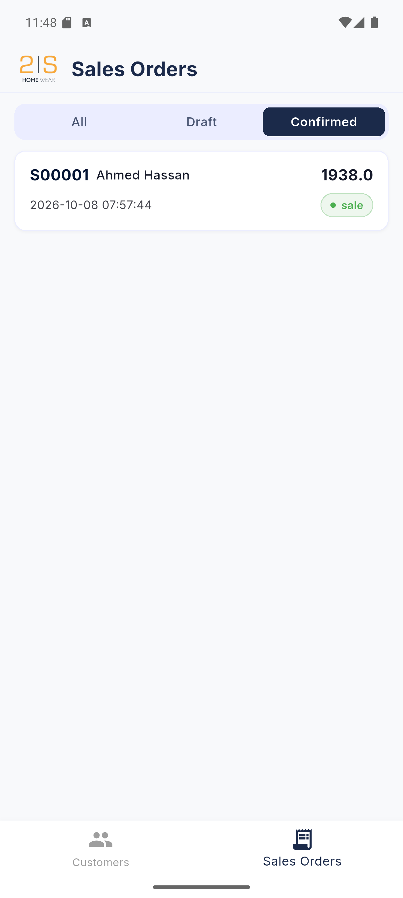 |
| Filtered draft quotations | Filtered confirmed orders (`state == sale`) |

#### Order Confirmation Lifecycle

| Draft Order Line Items | Confirm Order Dialog | Confirmed Order Details |
| :---: | :---: | :---: |
| 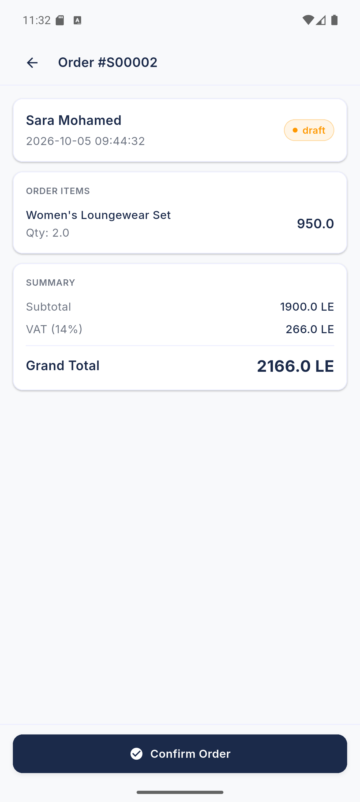 | 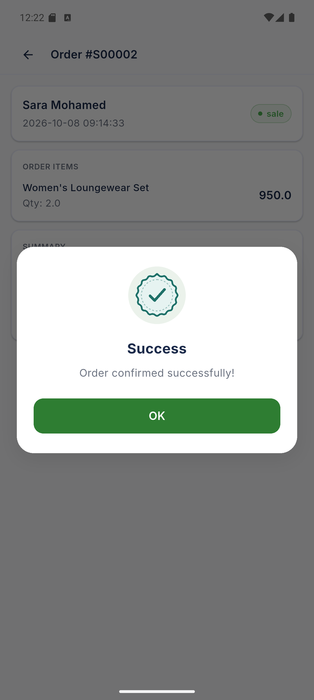 | 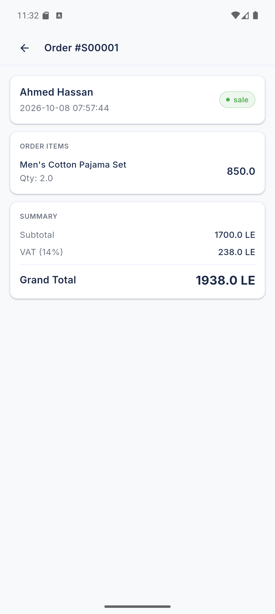 |
| Items, quantities, prices & VAT | Live `action_confirm` prompt | Read-only state updated to `sale` |

---

## 🏛️ Architecture & Project Structure

The project follows **Clean Architecture** with a **Feature-First** modular structure:

```
lib/
├── core/              # Shared infrastructure & utilities
│   ├── api/           # Dio client, Endpoints, Cookie & Session Interceptors
│   ├── cache/         # Shared preferences & Session persistence
│   ├── config/        # Routes & App themes
│   ├── di/            # Dependency Injection (GetIt & Injectable)
│   ├── errors/        # Failures & Error Handling
│   ├── utils/         # AuthHelper, InternetChecker & NavigatorKey
│   └── widgets/       # Shared custom UI widgets & dialogs
│
└── features/          # Feature modules
    ├── login/         # Auth, session ID extraction & auto-login
    ├── customers_tab/ # Customers local/remote sources, Hive cache & sync
    ├── sales_tab/     # Sales orders local/remote sources, Hive cache & sync
    └── home/          # Navigation bar & Role-Based Access gating
```

### Architectural Principles

* **Separation of Concerns:**
  * **Presentation:** Screens, Widgets & Cubits for state management.
  * **Domain:** Pure Dart Entities (with Hive TypeAdapters), UseCases & Repository contracts.
  * **Data:** Models, Local Data Sources (Hive boxes), Remote Data Sources (Dio) & Repository implementations.
* **Offline-First Synchronization (KISS & YAGNI):**
  * Data sources queue pending offline modifications (`pending_phone_updates`, `pending_confirm_orders`).
  * Repositories automatically flush and synchronize pending queues **before** fetching fresh data from Odoo.
* **Dependency Injection:** Handled automatically via `get_it` and `injectable`.
* **Safe Error Handling:** Uses `dartz` (`Either<Failures, T>`) for functional, type-safe error branching.

---

## ⚙️ Key Features

* **Authentication, Session Persistence & Auto-Login:**
  * Authenticates users via Odoo `/web/session/authenticate`.
  * Extracts and persists `session_id` to maintain sessions across app restarts.
  * Auto-login routes authenticated users directly to `HomeScreen` even without network.
  * Global session expiration interceptor redirects to login with user feedback.

* **Customer Directory & Phone Updates:**
  * Displays customers where `customer_rank > 0`.
  * Real-time search filtering by customer name.
  * In-place phone editing with validation for Egyptian mobile numbers (`010`, `011`, `012`, `015`).
  * Direct updates to Odoo via `res.partner` `write` method.

* **Sales Orders & Role-Based Access Control (RBAC):**
  * Role verification for internal sales users (`base.group_user` / `is_internal_user`).
  * Lists commercial sales orders with status filtering: **All**, **Draft**, or **Confirmed**.
  * Detailed order line items inspection (`sale.order.line`): products, quantities, prices, VAT, and totals.
  * Ability to confirm draft orders to Odoo via `action_confirm`.

* **Offline Caching & Automatic Synchronization (Bonus):**
  * **Offline Viewing:** Cached customers, sales orders, and order line details are viewable offline when network is disconnected.
  * **Offline Editing:** Phone updates and order confirmations update the local cache immediately for instantaneous UI feedback.
  * **Pending Queues:** Offline operations are safely stored in persistent Hive queues (`pending_phone_updates` and `pending_confirm_orders`).
  * **Automatic Background Sync:** On reconnection, pending changes are automatically synced to Odoo before querying fresh records.

---

## 🔌 Odoo Integration Details

Communication with Odoo ERP is implemented via **JSON-RPC 2.0**:

| Odoo Model | Operation | Description |
| :--- | :--- | :--- |
| `res.users` | `/web/session/authenticate` | Authenticates user credentials & extracts session cookie. |
| `res.partner` | `search_read` | Fetches customer list where `customer_rank > 0`. |
| `res.partner` | `write` | Updates customer phone numbers. |
| `sale.order` | `search_read` | Retrieves sales orders and quotations. |
| `sale.order` | `action_confirm` | Confirms draft quotations into confirmed sales orders. |
| `sale.order.line` | `search_read` | Fetches products and pricing for a specific order. |

---

## 🚀 Getting Started

### Prerequisites

* Flutter SDK (`>= 3.13.4`)
* Dart SDK (`>= 3.13.4`)

### Setup Steps

1. **Clone the repository:**

   ```bash
   git clone https://github.com/FakhrElddin/2s_sales_app.git
   cd 2s_sales_app
   ```

2. **Install dependencies:**

   ```bash
   flutter pub get
   ```

3. **Generate TypeAdapters & DI code:**

   ```bash
   dart run build_runner build --delete-conflicting-outputs
   ```

4. **Run the app:**

   ```bash
   flutter run
   ```

---

## 🛣️ Roadmap

* [x] **1. Login Screen:** Authentication against Odoo with session persistence & error dialog.
* [x] **2. Customer List Screen:** Searchable directory filtered by `customer_rank > 0`.
* [x] **3. Customer Details Screen:** Egyptian mobile validation & phone update to Odoo.
* [x] **4. Internal Users – Sales Orders:** Role-based access gating (`base.group_user`), order filters & `action_confirm`.
* [x] **5. Offline Handling & Two-Way Sync (Bonus):** Complete offline persistence using `Hive`, auto-login, offline edits & background synchronization.

---

<div align="center">
  <sub>Built for the 2S Homewear Technical Assessment</sub>
</div>
